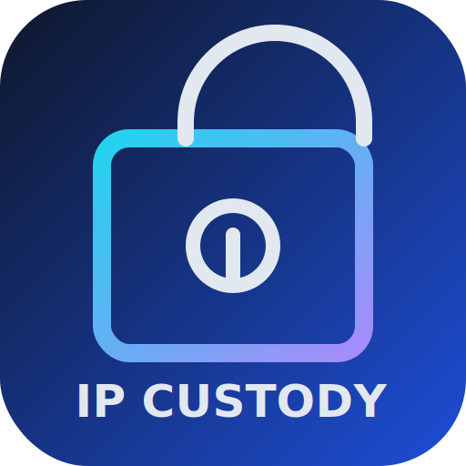

- 👋 Hi, I’m @Foxsinofgreed1
- 👀 I’m interested in ...
- 🌱 I’m currently learning ...
- 💞️ I’m looking to collaborate on ...
- 📫 How to reach me ...
- 😄 Pronouns: ...
- ⚡ Fun fact: ...

<!---
Foxsinofgreed1/Foxsinofgreed1 is a ✨ special ✨ repository because its `README.md` (this file) appears on your GitHub profile.
You can click the Preview link to take a look at your changes.
--->

## Local branding assets
- `assets/logo.svg`: Full IP Custody logo (wordmark + lock/vault motif), intended for README headers, splash sections, and larger UI contexts.
- `assets/icon.svg`: Compact square app icon (same brand language), intended for favicon/app launcher usage.

### Quick usage
```html

<link rel="icon" href="assets/icon.svg" type="image/svg+xml" />
```

## Project setup and troubleshooting
For WSL/Python/Rust/ngrok setup and packaging instructions, see:
- `SETUP_AND_TROUBLESHOOTING.md`
- `TODO.md` (prioritized fix plan)
